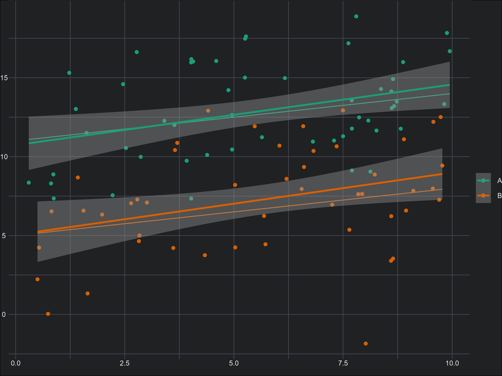

## Overview

This 3^rd^ year undergraduate course aims to give students a genuine understanding of statistical theory and modelling in biological sciences. The goal is for students to be able to translate statistical ideas to their own research questions, particularly when they reach their honours projects. `R` and `ggplot2` are used throughout.

::: {.columns}

::: {.column width="50%"}

### Topics Covered

- Why do we need statistics?  
- Introduction to linear models (LM) and hidden assumptions  
- The theory of effective data visualisation  
- `R` and `ggplot2`  
- LMs with a continuous predictor  
- Interpreting LMs with a continuous predictor  
- Assessing assumptions of LMs with a continuous predictor  
- LMs with a categorical predictor  
- Interpreting LMs with a categorical predictor  
- Assessing assumptions of LMs with a categorical predictor  
- LMs with multiple predictors  
- Confounding and causality  
- Null Hypothesis Significance Testing and P-values  
- An Information Criterion (AIC)  
- An introduction to GLMs  
- Poisson GLMs  

:::

::: {.column width="50%"}

 

 

 

 

 

 

:::

:::

---

## Tools & Software

- `R`
- RStudio
- `ggplot2`

---

[$\leftarrow$ Back to all courses](courses.qmd)
