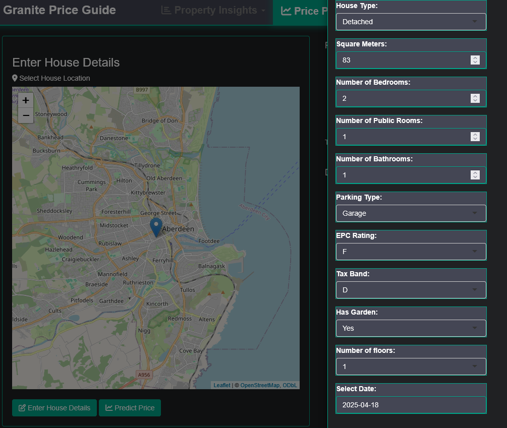
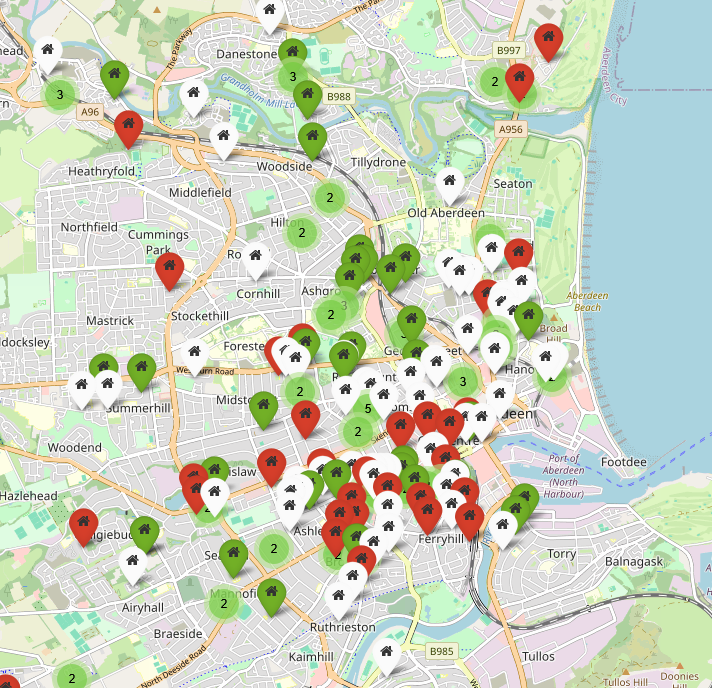

```{=html}
<div class="page-header">
  <h1 class="page-header-title">Explainers</h1>
  <p class="page-header-intro">Detailed walkthroughs of statistical models and methods, primarily written for students doing their honours projects, but available to anyone who wants them.</p>
</div>
```

## Models & Concepts

```{=html}
<div class="course-list">

  <a href="https://alexd106.github.io/PGR-GLM/" class="explainer-card" target="_blank">
    <div class="explainer-card-img-wrap">
      
    </div>
    <div class="explainer-card-content">
      <div class="explainer-card-title">Introduction to GLMs</div>
      <p class="explainer-card-desc">Course materials covering the theory and application of Generalised Linear Models, from model structure through to interpretation. Part of the PGR course series.</p>
    </div>
  </a>

  <a href="https://deonroos.github.io/Occupancy_Modelling/" class="explainer-card" target="_blank">
    <div class="explainer-card-img-wrap">
      
    </div>
    <div class="explainer-card-content">
      <div class="explainer-card-title">Bayesian Occupancy Models</div>
      <p class="explainer-card-desc">A walkthrough of occupancy modelling for ecologists working with presence/absence data where detection is imperfect. Covers the theory and implementation in R.</p>
    </div>
  </a>

  <a href="stm-explainer.html" class="explainer-card">
    <div class="explainer-card-img-wrap">
      
    </div>
    <div class="explainer-card-content">
      <div class="explainer-card-title">Structural Topic Models</div>
      <p class="explainer-card-desc">A detailed explainer covering the theory and R implementation of Structural Topic Models for text analysis. Written to be accessible to researchers without a machine learning background.</p>
    </div>
  </a>

  <a href="https://deonroos.github.io/Robust_Design/" class="explainer-card" target="_blank">
    <div class="explainer-card-img-wrap">
      
    </div>
    <div class="explainer-card-content">
      <div class="explainer-card-title">Robust Design Mark-Recapture</div>
      <p class="explainer-card-desc">An introduction to robust design mark-recapture for estimating population size and demographic parameters from capture history data.</p>
    </div>
  </a>

</div>
```

## Applied Data Products

```{=html}
<div class="course-list">

  <a href="https://deonroos.shinyapps.io/Aberdeen_House_Prices/" class="explainer-card" target="_blank">
    <div class="explainer-card-img-wrap">
      
    </div>
    <div class="explainer-card-content">
      <div class="explainer-card-title">Predicting House Prices</div>
      <p class="explainer-card-desc">A production Shiny application backed by an automated data pipeline. Property listings are scraped on a scheduled basis, cleaned, and stored in a SQLite database. The application serves live predictions from a fitted regression model without re-querying the source on demand. Built to give students a locally relevant end-to-end modelling example, from raw data ingestion through to a live interactive front-end.</p>
    </div>
  </a>

</div>
```

## Research Protocols

```{=html}
<div class="course-list">

  <a href="camera-trapping.html" class="explainer-card">
    <div class="explainer-card-img-wrap">
      
    </div>
    <div class="explainer-card-content">
      <div class="explainer-card-title">Camera Trap Pipeline</div>
      <p class="explainer-card-desc">End-to-end protocol for the North East Scotland long-term camera trapping project: Epicollect5 field recording, AddaxAI image classification with DeepFaune v1.4, Shiny app verification, and camtrapR detection history generation for occupancy modelling.</p>
    </div>
  </a>

</div>
```

## Teaching Aids

```{=html}
<div class="course-list">

  <a href="https://deonroos.shinyapps.io/Distributions/" class="explainer-card" target="_blank">
    <div class="explainer-card-img-wrap">
      
    </div>
    <div class="explainer-card-content">
      <div class="explainer-card-title">Statistical Distributions</div>
      <p class="explainer-card-desc">An interactive explorer for common statistical distributions with adjustable parameters, built to help students build intuition for how distributions behave.</p>
    </div>
  </a>

  <a href="https://deonroos.shinyapps.io/BI3010_Rent/" class="explainer-card" target="_blank">
    <div class="explainer-card-img-wrap">
      
    </div>
    <div class="explainer-card-content">
      <div class="explainer-card-title">Predicting Rent Prices</div>
      <p class="explainer-card-desc">A companion app to BI3010 for exploring rent price prediction, giving students a second worked example to consolidate their understanding of regression.</p>
    </div>
  </a>

</div>
```
