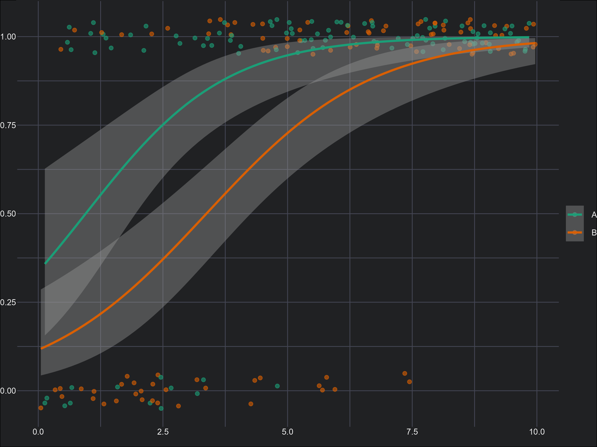
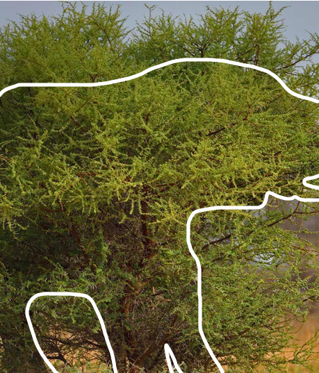
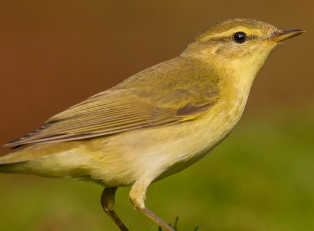
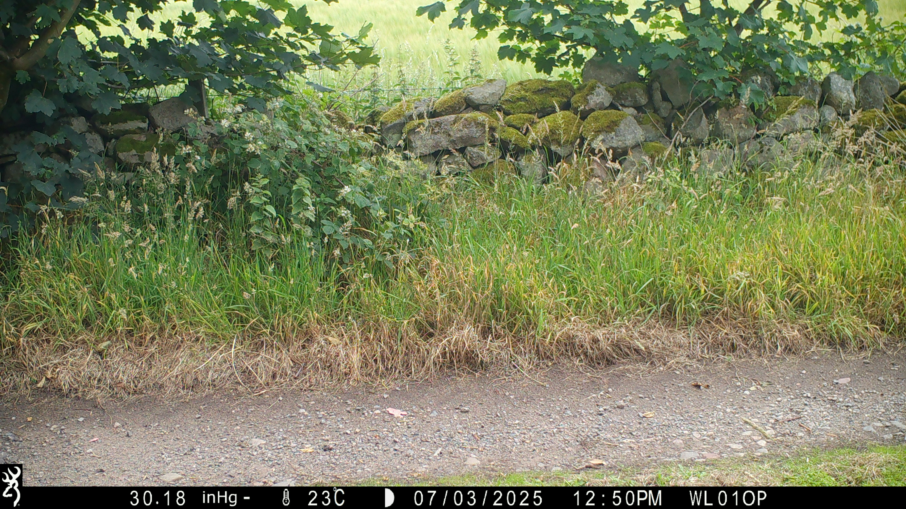
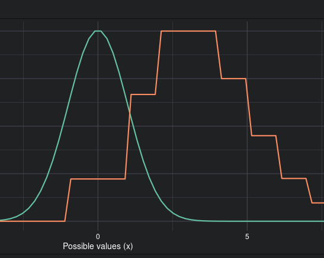

```{=html}
<!-- ============ HERO (ink) ============ -->
<section id="top" class="band band--ink">
  <div class="band__inner band__inner--tight">
    <div class="eyebrow hero__eyebrow">Lecturer in Applied Statistics, University of Aberdeen</div>
    <h1 class="pp-display pp-display--hero hero__title">I answer<br>questions<br>with <span class="accent">data.</span></h1>
    <div class="hero__meta">
      <p class="lead-serif hero__quote">Most of the job is working out what the data can&rsquo;t tell you.</p>
      <div class="hero__eq">
```

$$\mu_i = f(\rho_{0,i}) + f(\rho_{1,i}) + f(\rho_{2,i})$$

$$\rho_{j,i} = T + \left(\frac{1}{\zeta_{j,i}}\right) \times D_{j,i} \quad \text{for } j \in \{0, 1, 2\}$$

$$D_{j,i} = -\sqrt{(x_j - x_i)^2 + (y_j - y_i)^2}$$

$$\zeta_{j,i} = \beta_0 + \beta_1 \times z_i$$

```{=html}
      </div>
    </div>
  </div>
  <div class="hero__fig">
    <div class="hero__fig-head">
      <span class="hero__fig-cap">FIG., TRAVELLING WAVES ACROSS A SIMULATED HABITAT</span>
      <span class="hero__fig-cap">z &#8764; fBm &middot; 3 SOURCES</span>
    </div>
    <canvas id="pp-wave" class="hero__canvas" aria-label="Animated travelling waves radiating from three sources across a simulated habitat layer"></canvas>
    <div class="hero__scroll"><span>&#8595;&nbsp;&nbsp;SCROLL</span></div>
  </div>
</section>

<!-- ============ 01 METHOD (oat) ============ -->
<section id="method" class="band band--oat">
  <div class="band__inner">
    <div class="sec-head">
      <span class="sec-head__num">01</span>
      <span class="sec-head__label">How I work</span>
    </div>
    <p class="pull-quote">The question decides the model, not the other way round.</p>
    <div class="col3">
      <div>
        <div class="col-label">Data</div>
        <p>I generally work with messy data, collected, scraped, or simulated, and often not actually measuring what we hope it does.</p>
      </div>
      <div>
        <div class="col-label">Fields</div>
        <p>Interdisciplinary, but a lot in biology and medicine.</p>
      </div>
      <div>
        <div class="col-label">Approach</div>
        <p>No favourite method. Mostly hierarchical, Bayesian, and simulation-based models, chosen to suit the question.</p>
      </div>
    </div>
  </div>
</section>

<!-- ============ 02 PUBLICATIONS (ink) ============ -->
<section id="work" class="band band--ink">
  <div class="band__inner">
    <div class="sec-head sec-head--split">
      <div class="sec-head__group">
        <span class="sec-head__num">02</span>
        <span class="sec-head__label">Selected work</span>
      </div>
      <span class="mono-cap">SYNCED FROM ORCID &middot; 0000-0003-4866-7472</span>
    </div>
```

```{r echo=FALSE, results='asis', message=FALSE, warning=FALSE}
library(httr)
library(jsonlite)
library(glue)
library(purrr)

orcid_id <- "0000-0003-4866-7472"

render_row <- function(year, citation, link) {
  yr <- if (is.null(year) || is.na(year)) "" else year
  inner <- glue(
    '<span class="pub-row__year">{yr}</span>',
    '<span class="pub-row__cite">{citation}</span>',
    '<span class="pub-row__arrow">&#8599;</span>'
  )
  if (!is.null(link)) {
    glue('<a href="{link}" class="pub-row" target="_blank" rel="noopener">{inner}</a>')
  } else {
    glue('<div class="pub-row">{inner}</div>')
  }
}

res <- tryCatch(
  GET(glue("https://pub.orcid.org/v3.0/{orcid_id}/works"), accept("application/json")),
  error = function(e) NULL
)

if (!is.null(res) && res$status_code == 200) {
  data <- content(res, as = "parsed", type = "application/json")
  works <- list()

  for (work in data$group) {
    summary  <- work$`work-summary`[[1]]
    put_code <- summary$`put-code`

    detail_res <- tryCatch(
      GET(glue("https://pub.orcid.org/v3.0/{orcid_id}/work/{put_code}"), accept("application/json")),
      error = function(e) NULL
    )
    if (is.null(detail_res) || detail_res$status_code != 200) next

    wd      <- content(detail_res, as = "parsed", type = "application/json")
    title   <- wd$title$title$value
    journal <- wd$`journal-title`$value %||% ""
    year    <- wd$`publication-date`$year$value %||% NA

    contributors <- wd$contributors$contributor
    authors <- if (!is.null(contributors)) {
      raw <- map_chr(contributors, \(a) a$`credit-name`$value %||% "")
      hl  <- map_chr(raw, \(name) {
        if (grepl("(?i)roos", name)) glue("<span class='me'>{name}</span>") else name
      })
      paste(hl[hl != ""], collapse = ", ")
    } else ""

    citation <- glue("{authors}, {title}.{if (journal != '') glue(' <em>{journal}</em>') else ''}")

    link <- NULL
    ext  <- wd$`external-ids`$`external-id`
    if (!is.null(ext)) {
      for (id in ext) {
        if (tolower(id$`external-id-type`) == "doi") {
          link <- glue("https://doi.org/{id$`external-id-value`}")
          break
        }
      }
    }

    works[[length(works) + 1]] <- list(
      year = year, citation = citation, link = link,
      yr_num = suppressWarnings(as.integer(year))
    )
  }

  if (length(works) > 0) {
    ord   <- order(map_dbl(works, \(w) ifelse(is.na(w$yr_num), -Inf, w$yr_num)), decreasing = TRUE)
    works <- works[ord]
    n      <- length(works)
    head_n <- min(5, n)

    for (i in seq_len(head_n)) {
      w <- works[[i]]
      cat(render_row(w$year, w$citation, w$link), "\n")
    }

    if (n > head_n) {
      rest <- n - head_n
      cat(glue(
        '<button type="button" id="pubs-toggle" class="pub-toggle" data-label-show="Show earlier work ({rest})">',
        '<span data-sign class="pub-toggle__sign">+</span>',
        '<span data-label class="pub-toggle__label">Show earlier work ({rest})</span></button>'
      ), "\n")
      cat('<div id="pubs-older" style="display:none;">', "\n")
      for (i in (head_n + 1):n) {
        w <- works[[i]]
        cat(render_row(w$year, w$citation, w$link), "\n")
      }
      cat('</div>', "\n")
    }
  } else {
    cat("<p class='body-copy'>No publications found on ORCID.</p>")
  }
} else {
  cat("<p class='body-copy'>Unable to fetch publications from ORCID at this time.</p>")
}
```

```{=html}
    <div class="tbook">
      <div>
        <div class="tbook__label">Open-access textbook</div>
        <div class="tbook__title">An Introduction to R. Free, online, and available to anyone.</div>
      </div>
      <a href="https://intro2r.com" target="_blank" rel="noopener" class="tbook__cta">Read it &#8599;</a>
    </div>
    <div class="footnote-mono">Most recent output shown; the full list is pulled automatically from ORCID.</div>
  </div>
</section>

<!-- ============ 03 TEACHING (oat) ============ -->
<section id="teaching" class="band band--oat">
  <div class="band__inner">
    <div class="sec-head">
      <span class="sec-head__num">03</span>
      <span class="sec-head__label">Teaching</span>
    </div>
    <p class="body-copy" style="max-width:60ch;margin-top:26px;">Statistics courses at undergraduate and postgraduate level, focused on building genuine understanding rather than recipe-following.</p>
    <div class="teach-grid">
      <div class="teach-card">
        <div class="teach-card__tag">3RD YEAR UNDERGRADUATE</div>
        <h3 class="teach-card__title">BI3010, Statistical Analysis of Biological Data</h3>
        <p class="teach-card__desc">From linear models through to GLMs. The goal is understanding the theory well enough to apply it to your own questions, with R and ggplot2 throughout.</p>
        <div class="chip-row">
          <span class="chip">R</span><span class="chip">ggplot2</span><span class="chip">Linear Models</span><span class="chip">GLMs</span><span class="chip">Causal Inference</span>
        </div>
        <div>
          <a href="bi3010.html" class="teach-card__link">Course details &rarr;</a>
          <a href="https://deonroos.github.io/stats-for-biologists/" target="_blank" rel="noopener" class="teach-card__link">Workshop materials &rarr;</a>
        </div>
      </div>
      <div class="teach-card">
        <div class="teach-card__tag">POSTGRADUATE / PHD</div>
        <h3 class="teach-card__title">PGR, Generalised Linear Models</h3>
        <p class="teach-card__desc">A free course on the theory and application of GLMs, open to students from any university and any discipline, part of a wider series covering R and linear models.</p>
        <div class="chip-row">
          <span class="chip">R</span><span class="chip">Poisson GLM</span><span class="chip">Binomial GLM</span><span class="chip">Bernoulli GLM</span>
        </div>
        <div>
          <a href="pgr-glm.html" class="teach-card__link">Course details &rarr;</a>
        </div>
      </div>
    </div>
    <div class="subhead-mono">Guest lectures</div>
    <div class="guest">
      <span class="guest__code">PU5058</span>
      <div>
        <span class="guest__title">Introduction to Health Data Science</span>
        <span class="guest__desc">The theory underlying effective data visualisation.</span>
      </div>
      <span class="chip">Postgraduate</span>
    </div>
  </div>
</section>

<!-- ============ 04 EXPLAINERS (ink) ============ -->
<section id="explainers" class="band band--ink">
  <div class="band__inner">
    <div class="sec-head">
      <span class="sec-head__num">04</span>
      <span class="sec-head__label">Explainers</span>
    </div>
    <p class="body-copy" style="max-width:60ch;margin-top:26px;">Detailed walkthroughs of statistical models, methods, protocols, and concepts, mostly written for students working with me during their honours projects, but available to anyone who wants them.</p>
    <div class="xp-grid">
      <a href="https://alexd106.github.io/PGR-GLM/" target="_blank" rel="noopener" class="xp-card">
        <div class="xp-card__head"><span class="xp-card__tag">MODELS</span></div>
        <div class="xp-card__body">
          <h4 class="xp-card__title">Introduction to GLMs</h4>
          <p class="xp-card__desc">Theory and application of GLMs, from model structure to interpretation. Part of the PGR series.</p>
        </div>
      </a>
      <a href="https://deonroos.github.io/Occupancy_Modelling/" target="_blank" rel="noopener" class="xp-card">
        <div class="xp-card__head"><span class="xp-card__tag">MODELS</span></div>
        <div class="xp-card__body">
          <h4 class="xp-card__title">Bayesian Occupancy Models</h4>
          <p class="xp-card__desc">Occupancy modelling for presence/absence data with imperfect detection, theory and R.</p>
        </div>
      </a>
      <a href="stm-explainer.html" class="xp-card">
        <div class="xp-card__head"><span class="xp-card__tag">MODELS</span></div>
        <div class="xp-card__body">
          <h4 class="xp-card__title">Structural Topic Models</h4>
          <p class="xp-card__desc">STMs for text analysis, written to be accessible without a machine-learning background.</p>
        </div>
      </a>
      <a href="https://deonroos.github.io/Robust_Design/" target="_blank" rel="noopener" class="xp-card">
        <div class="xp-card__head"><span class="xp-card__tag">MODELS</span></div>
        <div class="xp-card__body">
          <h4 class="xp-card__title">Robust Design Mark-Recapture</h4>
          <p class="xp-card__desc">Estimating population size and demographic parameters from capture-history data.</p>
        </div>
      </a>
      <a href="camera-trapping.html" class="xp-card">
        <div class="xp-card__head"><span class="xp-card__tag is-protocol">PROTOCOL</span></div>
        <div class="xp-card__body">
          <h4 class="xp-card__title">Camera Trap Pipeline</h4>
          <p class="xp-card__desc">End-to-end protocol for the NE Scotland project: field recording to camtrapR detection histories.</p>
        </div>
      </a>
      <a href="https://deonroos.shinyapps.io/Distributions/" target="_blank" rel="noopener" class="xp-card">
        <div class="xp-card__head"><span class="xp-card__tag is-teaching">TEACHING AID</span></div>
        <div class="xp-card__body">
          <h4 class="xp-card__title">Statistical Distributions</h4>
          <p class="xp-card__desc">Interactive explorer with adjustable parameters, to build intuition for how distributions behave.</p>
        </div>
      </a>
    </div>
  </div>
</section>

<!-- ============ 05 PEOPLE (oat) ============ -->
<section id="people" class="band band--oat">
  <div class="band__inner">
    <div class="sec-head">
      <span class="sec-head__num">05</span>
      <span class="sec-head__label">People &amp; supervision</span>
    </div>
    <p class="body-copy" style="max-width:60ch;margin-top:26px;">PhD students I currently supervise, and the undergraduate honours theses I&rsquo;ve supervised.</p>

    <div class="subhead-mono">PhD Students</div>
    <div class="people-grid">
      <div class="person">
        <div class="person__name">Seungyeon Lee</div>
        <div class="person__uni">University of Aberdeen</div>
        <div class="person__date">2024 &ndash; Present</div>
        <p class="person__topic">Integrated population models of tawny owls.</p>
      </div>
      <div class="person">
        <div class="person__name">James Owen</div>
        <div class="person__uni">Queen&rsquo;s University Belfast</div>
        <div class="person__date">2025 &ndash; Present</div>
        <p class="person__topic">Geoprofiling methodology development.</p>
      </div>
      <div class="person">
        <div class="person__name">Joe Davidson</div>
        <div class="person__uni">University of Aberdeen</div>
        <div class="person__date">2026 &ndash; Present</div>
        <p class="person__topic">Predicting vole population cycles using raptor data.</p>
      </div>
      <div class="person">
        <div class="person__name">Sam Durston</div>
        <div class="person__uni">University of St Andrews</div>
        <div class="person__date">2026 &ndash; Present</div>
        <p class="person__topic">Refining spatial methodology for marine environments.</p>
      </div>
    </div>

    <div class="subhead-mono">Undergraduate Theses <span style="color:var(--oat-muted-2);text-transform:none;letter-spacing:0;">(click a row to download)</span></div>
    <a href="theses/DeonRoos_2015.pdf" class="thesis-row">
      <span class="thesis-row__year">2015</span>
      <span class="thesis-row__title"><strong>Deon Roos</strong>, Water vole ecosystem engineering</span>
      <span class="thesis-row__ext">PDF &#8595;</span>
    </a>
    <a href="theses/ShananDavies_2024.pdf" class="thesis-row">
      <span class="thesis-row__year">2024</span>
      <span class="thesis-row__title"><strong>Shanan Davies</strong>, Roe deer occupancy and habitat preferences</span>
      <span class="thesis-row__ext">PDF &#8595;</span>
    </a>
    <a href="theses/AliceSemple_2024.pdf" class="thesis-row">
      <span class="thesis-row__year">2024</span>
      <span class="thesis-row__title"><strong>Alice Semple</strong>, Predicting vole population growth and cycles</span>
      <span class="thesis-row__ext">PDF &#8595;</span>
    </a>
    <a href="theses/JoeDavidson_2025.pdf" class="thesis-row">
      <span class="thesis-row__year">2025</span>
      <span class="thesis-row__title"><strong>Joe Davidson</strong>, Post-release pheasant distribution</span>
      <span class="thesis-row__ext">PDF &#8595;</span>
    </a>
    <a href="theses/GraceSommerville_2025.pdf" class="thesis-row">
      <span class="thesis-row__year">2025</span>
      <span class="thesis-row__title"><strong>Grace Sommerville</strong>, Media coverage of illegal lynx reintroduction</span>
      <span class="thesis-row__ext">PDF &#8595;</span>
    </a>
    <a href="theses/ZitongLui_2025.docx" class="thesis-row">
      <span class="thesis-row__year">2025</span>
      <span class="thesis-row__title"><strong>Zitong Lui</strong>, Roe deer and road collision risk</span>
      <span class="thesis-row__ext">DOCX &#8595;</span>
    </a>
  </div>
</section>

<!-- ============ 06 CAREER (ink) ============ -->
<section id="career" class="band band--ink">
  <div class="band__inner">
    <div class="sec-head sec-head--split">
      <div class="sec-head__group">
        <span class="sec-head__num">06</span>
        <span class="sec-head__label">Career</span>
      </div>
      <span class="mono-cap">ZOOLOGY &rarr; ECOLOGY &rarr; APPLIED STATISTICS</span>
    </div>
    <div class="tl">
      <div class="tl__row">
        <span class="tl__label">Education</span>
        <div class="tl__track">
          <div class="tl__bar tl__bar--edu" style="left:0%;width:28.6%;">BSc Zoology</div>
          <div class="tl__bar tl__bar--edu2" style="left:29.6%;width:34.7%;">PhD Ecology</div>
        </div>
      </div>
      <div class="tl__row">
        <span class="tl__label">Employment</span>
        <div class="tl__track">
          <div class="tl__bar tl__bar--emp" style="left:57.1%;width:14.3%;">Fellowships</div>
          <div class="tl__bar tl__bar--emp" style="left:72.4%;width:13.3%;">APHA</div>
          <div class="tl__bar tl__bar--now" style="left:86.7%;right:0;">Lecturer</div>
        </div>
      </div>
      <div class="tl__row">
        <span class="tl__label"></span>
        <div class="tl__axis">
          <span class="tl__tick" style="left:0%;">2012</span>
          <span class="tl__tick" style="left:28.6%;">2016</span>
          <span class="tl__tick" style="left:57.1%;">2020</span>
          <span class="tl__tick" style="left:85.7%;">2024</span>
          <span class="tl__tick tl__tick--now" style="right:0;">NOW</span>
        </div>
      </div>
    </div>
    <p class="body-copy" style="font-size:12.5px;line-height:1.7;color:var(--ink-muted);margin-top:20px;max-width:80ch;">Currently <span style="color:var(--amber);font-weight:600;">Lecturer in Applied Statistics, University of Aberdeen</span>, previously Senior Statistical Ecologist at the Animal &amp; Plant Health Agency, and Teaching / Research Fellow at Aberdeen. PhD Ecology (rodent pest population dynamics) and a First-Class BSc Zoology, both Aberdeen.</p>
    <div class="chip-row" style="margin-top:26px;">
      <span class="chip">R</span><span class="chip">Bayesian inference</span><span class="chip">Spatio-temporal modelling</span><span class="chip">Hierarchical models</span><span class="chip">Occupancy modelling</span><span class="chip">Simulation-based inference</span><span class="chip">Causal inference</span><span class="chip">RShiny</span><span class="chip">Quarto</span>
    </div>
    <div style="display:flex;flex-wrap:wrap;gap:14px;margin-top:30px;">
      <a href="cv.html" class="btn btn--solid">Full CV &rarr;</a>
    </div>
  </div>
</section>

<!-- ============ 07 CONTACT (oat) ============ -->
<section id="contact" class="band band--oat">
  <div class="band__inner">
    <div class="sec-head__group" style="display:flex;align-items:baseline;gap:16px;">
      <span class="sec-head__num">07</span>
      <span class="sec-head__label">Get in touch</span>
    </div>
    <h2 class="pp-display pp-display--xl contact__title" style="color:var(--oat-ink);">Questions<br><span class="accent">welcome.</span></h2>
    <div class="contact__links">
      <a href="mailto:deon.roos4@abdn.ac.uk" class="contact__link is-primary">deon.roos4@abdn.ac.uk</a>
      <a href="https://orcid.org/0000-0003-4866-7472" target="_blank" rel="noopener" class="contact__link">ORCID &#8599;</a>
      <a href="https://github.com/DeonRoos" target="_blank" rel="noopener" class="contact__link">GitHub &#8599;</a>
      <a href="cv.html" class="contact__link">Full CV &rarr;</a>
    </div>
  </div>
</section>
```
