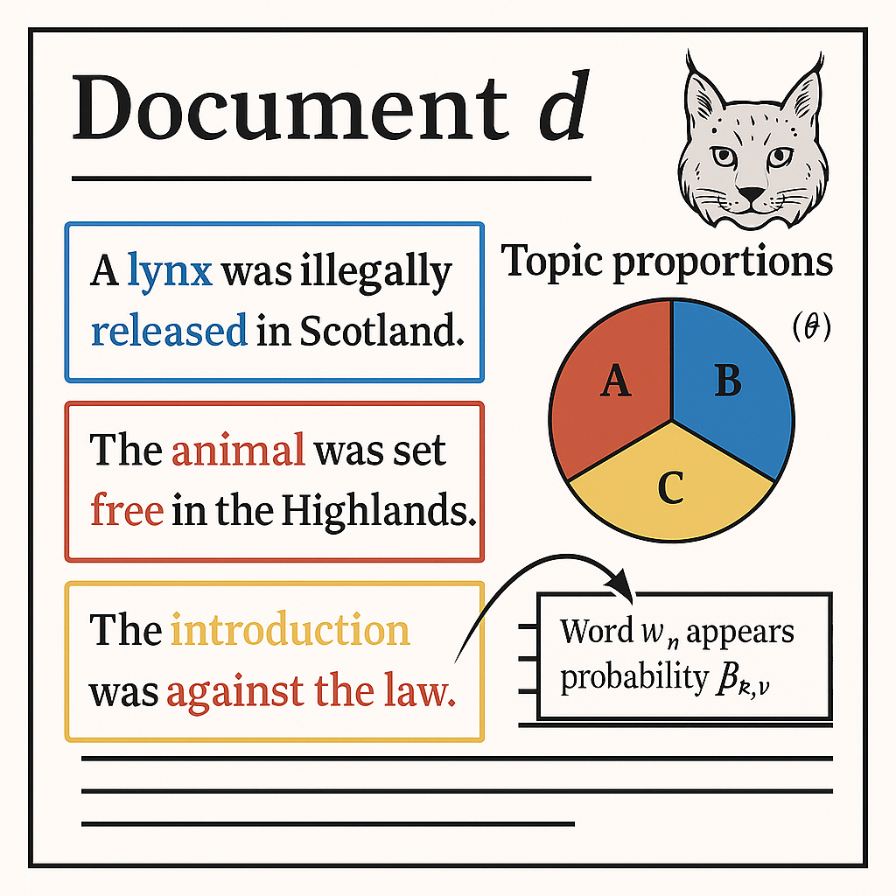

```{r setup}
#| include: false
#| message: false
#| warning: false
library(knitr)
opts_chunk$set(echo = TRUE)
```

Hey Grace,

I've written this page for you and your honours project. I've aimed to keep it accessible, covering both the core theory behind the stats you'll use (Structural Topic Models, STMs) but also how to actually implement them. That said, the theory can get complex at times, and I'm still learning it myself! (It's also surprisingly hard to find good, clear explanations online.) It took me a while to make sense of the stats, so don't worry if it also takes you some time. Be patient with when learning this material.

To be clear, this page isn't meant to replace our meetings or turn me into a hands-off "supervisor." It's a resource you can return to whenever you need a refresher or some help getting unstuck.

Hopefully, this helps you get a handle on the method, but let me know if anything is confusing. It probably won't answer every question, and I won't be offended if you want to toss it in a bonfire. Just flag anything that's unclear, and we'll work through it together.

------------------------------------------------------------------------

# Why analyse text?

Let's say we want to understand how movie reviews have changed over time. How would we do that?

"Well," you might say, "maybe we could read thousands of reviews from the last 50 years and summarise them." That's technically possible but massively time-consuming. Even if we narrowed it down to the "best" reviews, we'd still face a huge pile of reading plus we'd now have the problem of how do you define which are the "best" reviews.

In fact, that's exactly what many arts PhD students do: read hundreds (or thousands) of documents and distill them into themes. But I'd argue I'm not smart enough to do an arts PhD so instead, I'd like to cheat and let computers do the hard work for me.

But how do we cheat?

This is where your thesis steps into a murky (but exciting) space between statistics and machine learning.

One option is *supervised learning*. This is where you tell the model what it *should* learn. For example, in BI3010 you learned:

$$
y_i \sim Normal(\mu_i, \sigma) \\
\mu_i = \beta_0 + \beta_1 \times x_i
$$

Here, the goal was to estimate \$\\beta_0\$ and \$\\beta_1\$. It's supervised because we've *defined* the task: "Fit this straight line."

Doing this with text means labelling each document manually. For example, marking them "Pro-Lynx" or "Anti-Lynx", and then fitting a model. Doable? Yes. But incredibly time-intensive, and not much easier than just summarising the documents yourself.

The other option is *unsupervised* learning. Here, you *don't* tell the model what to look for, you let it discover patterns on its own. The model identifies clusters or themes in the text, and your job afterward is simply to *interpret* those themes.

That's way more manageable.

There are many ways to do this (Large Language Models like ChatGPT use similar ideas), but for your project, we'll use a method called *Structural Topic Modelling* (STM).

## What is a Structural Topic Model?

A *Structural Topic Model (STM)* is a type of analysis that allows us to explore large sets of text documents and identify what the common themes are; called *topics*. Just like you did in BI3010, you can also include covariates (also called explanatory variables) to see if that makes a topic may be more or less prevalent.

> **Grace**, in your case, this might include things like how date (i.e. how has coverage of lynx changed over time), and if the illegal release of lynx (and maybe their interaction) may have changed which topics are more or less prevelant. For example, *did negative topics become more common in the media after the illegal release compared to before*?

STMs are a fairly complex beast, with lots of new ideas. One of these new ideas that I won't explain in this document is *Bayesian* statistics. Luckily, I have written another set of [documents](https://deonroos.github.io/Occupancy_Modelling/Bayesian_Statistics.html) that explain the general theory of this, which you are welcome and encouraged to read through. Although STMs, as implemented in the `R` package `stm`, use the *Bayesian* statistical framework, you can't actually interact with it, so it's not crucial to understand in this case. However, I would recommend trying to wrap your head around it, as it's a piece of knowledge that may make you highly employable.

With that said, let's go over, conceptually, what Structural Topic Models are going.

1.  We begin by gathering a *corpus*. This is a collection of *documents*, like newspaper articles. Our objective is to learn something about the *corpus*.
2.  We assume that within each *document,* there can exist multiple *topics*. Topics are the "themes" that the document covers; things like "Lynx are bad and we shouldn't release them" or "Lynx are good and we should release them".
3.  These *topics* are *latent*, which means "hidden" or "unobserved" (newspapers don't add a sticker on each article to say what the theme is afterall) and we want to use the STM to identify them and to see which are most prevalent.
4.  We state how many theme we *think* there are. This might be 5 or it might be 200. This is a choice we make. (There are some tools that can help make this choice.)
5.  Within each *document* we consider each *word*. We assume that each *word* is associated with one of these topics with differing probabilities. For example, if there is a topic for "Lynx are bad", then we might expect that "livestock" has a 90% chance of belonging to this topic, while "rewilding" only has a 0.5% chance.
6.  Each topic will have a distribution of words associated with it, each with their own probability to belong to that topic.

So our objective then, is to identify different *topics*, and which words tend to categorise those topics. This is what we're, fundamentally, trying to do in an STM.

# How do STMs work?

By the conceptual description above, you may notice something. STMs have a *hierarchical* structure. At the top level is the *document*, within which we have *topics*, within which we have *words*.

The have data we have is *document* and *words*, and we use these to estimate *topic*.

This *hierarchical* structure is common in many of the more advanced statistical methods, especially in ecology. Occupancy models are a type of this, as a Cormack-Jolly-Seber models which estimate the survival indivudual animals. For your heritage, know the Cormack and Jolly worked in Aberdeen when they developed the method. That's something to be super proud of! The CJS is such an important model in ecology that there are entire conferences dedicated to people using it.

## What does an STM look like?

Let's start with a simple way to visualise the data and output of an STM (apologies for the generative AI image):



The things to take away from this are to highlight that $d$ is just the current document you are looking at. $\theta_k$ describes the relative proportion of a document that is dedicated to topic $k$ (e.g. in the above figure we have three topics, called A, B and C). These topics are determined by the word ($w$, given all words $n$ used in the document $d$) within them, that appears in the topic ($k$) with probability $\beta$.

That's the simplified version. If we dive into the details, things get a bit more complex.

## The equations

We'll go through this step-by-step because the estimation process in structural topic modeling is complex (but powerful).

### 1. Document Topic Model

Our first objective is to understand, within a document, what proportion are given to each topic where we can have multiple topics (up to $K$ topics, e.g. 20). For example, an article may dedicate 50% to the topic "lynx are bad" and 50% to "protect livestock". Why are *these* the topics that we see? Well maybe the newspaper has a particular politically leaning, and newspapers that have this stance tend to include these topics. Maybe this was a few days *after* the illegal lynx release.

This first "sub-model" attempts to resolve that. The complication is that we will have multiple topics, and we need a proportion for each. In BI3010 the distributions you worked with, for example the Normal distribution, which only had a single average. To model how much of each topic is in a document, we need to estimate a proportion for each topic. But before we can turn these into proportions, we first create a set of 'topic scores', one for each topic. These scores are drawn from a distribution that lets topics vary together (some may be more likely to appear together), and for that, we use a *multivariate normal* distribution, which is just a version of the normal distribution that handles multiple, possibly correlated, values at once. This model will produce *multiple* averages, which we'll label with $\theta$ (note that because there are multiple values in $\theta$, we label it as $\vec{\theta}$). 

So this first sub-model is a type of Generalised Linear Model, except this GLM does not use a Poisson, like you did in BI3010, but the Multivariate Normal.

Here's how we describe it "formally":

For each document $d$ that we have, with covariates $\vec{X}_d$, we work with a vocabulary of size $V$ (that is, $V$ unique words appear across the documents), given $K$ topics, which we're going to fit using a GLM that uses a multivariate normal distribution (with a $\text{softmax}$ link function) to estimate which topic is present in a document (note that the "$\vec{}$" symbol is shorthand for *vector*, or a "column of data"):

$$
\vec{\theta} \sim \text{MVNorm}(\vec{\mu}, \boldsymbol\Sigma)
$$

$$
\text{softmax}(\vec{\mu}) = {X_d} \boldsymbol{\Gamma}
$$

> A multivariate normal distribution is like several normal distributions stacked together. So, instead of having just one mean and one variance, you have a mean and variance for each topic. The covariance matrix $\Sigma$ (which is the variance) also tells you how topics tend to co-occur, for example, maybe "Lynx are bad" often appears alongside "Predator control".

where $\vec{X}_d$ is a 1-by-$p$ vector (your covariates), $\Gamma$ is a $p$-by-($K-1$) matrix of coefficients (this is a way to describe all the parameters, $p$, in the model) and $\boldsymbol{\Sigma}$ is a ($K-1$)-by-($K-1$) covariance matrix.

Keep in mind, these $\theta$ values are like scores that indicate how much each topic is ‘preferred’ in a document. We turn these scores into probabilities using a transformation called the $\text{softmax}$, which ensures they sum to 1; like proportions should.

Here's what the $\text{MVNorm}$ distribution looks like when we have two averages with *differing* correlation (the $\rho$ values) between them:

```{r}
#| label: mnorm fig
#| message: false
#| warning: false
library(mvtnorm)
library(ggplot2)
library(dplyr)

make_density_df <- function(rho) {
  mu <- c(0, 0)
  sigma <- matrix(c(1, rho, rho, 1), nrow = 2)
  
  x <- seq(-3, 3, length.out = 100)
  y <- seq(-3, 3, length.out = 100)
  grid <- expand.grid(X1 = x, X2 = y)
  
  grid$z <- mvtnorm::dmvnorm(grid, mean = mu, sigma = sigma)
  grid$corr <- rho
  
  return(grid)
}

df_all <- bind_rows(
  make_density_df(-0.8),
  make_density_df(0),
  make_density_df(0.8)
)

ggplot(df_all, aes(x = X1, y = X2, z = z)) +
  geom_contour_filled(alpha = 0.8, show.legend = FALSE) +
  facet_wrap(~ corr, labeller = labeller(corr = function(x) paste0("ρ = ", x))) +
  coord_equal() +
  labs(
    x = expression(Y[1]),
    y = expression(Y[2])
  ) +
  theme_minimal(base_size = 14)
```


### 2. Topic-Word Model

At the same time, we want to determine the probability for each word to be associated with any of our topics. For instance, what is the probability that "kill", "predator", "rewilding" and "nature" belong to the topic "lynx are good"? That's what the Topic-Word model is tasked with solving.

Assume you included a document-level content covariate $y_d$ (e.g. Politically Left versus Politically Right newspaper), we can form a document-specific distribution of words (as a vector, or "column" of numbers), called $\boldsymbol{\beta}$, which represents each topic ($k$) by using:

We model the probability of each word as a combination of the baseline frequency of the word, how much more or less it appears in each topic, and how that might change depending on document metadata like political leaning. So we combine these effects additively in the log space, and then exponentiate to turn it back into probabilities.

-   The baseline word distribution ($m$, i.e. how common is this word across all documents),

-   The topic specific deviation $\boldsymbol{\kappa}^{(t)}_k$ (i.e. is that word more or less common in topic $k$)

-   The covariate group deviation $\boldsymbol{\kappa}^{(c)}_{y_d}$ (i.e. is that word more or less common in Politically Left or Right newspapers),

-   And the interaction between the two $\boldsymbol{\kappa}^{(i)}_{y_d,k}$ if we want one

which we can estimate by doing:

$$
\vec{\beta}_{d,k} \propto exp(\vec{m} + \vec{\kappa}^{(t)}_k + \vec{\kappa}^{(c)}_{y_d} + \vec{\kappa}^{(i)}_{y_d,k})
$$

> Read this as saying "the probability, $\beta$, to see a given unique word in document $d$, in topic $k$ is proportional to (the $\propto$ symbol) how common it is in general, as well as how common it is in the given topic and/or group"

This results in:

$$
\vec{\beta}_{d,k} = [\beta_{d,k,1}, \beta_{d,k,2}, ..., \beta_{d,k,V}]
$$

where $\vec{\beta}_{d,k}$ is a vector that contains the probability to see a given unique word (the $_{1,2,...,V}$ bit) in a topic ($k$), in a document ($d$)).

### 3. Estimating $\vec{\beta}_{d,k}$

Keep in mind that $\vec{\beta}_{d,k}$ should be a probability. But to figure it out we start by estimating the rate that at which we see each **unique** word ($v$) across the entire *corpus* using multiple Poisson GLMs; one for each unique word:

$$
w_v \sim Poisson(\lambda_v)
$$

$$
log(\lambda_v) = m_v + \kappa^{(t)}_{k,v} + \kappa^{(c)}_{y_d,v} + \kappa^{(i)}_{y_d,k,v}
$$

Here, $w_v$ is the observed count of word $v$. Remember from BI3010 that a Poisson GLM estimates a *rate* but here we need a probability. To do that, we take the estimated rate ($\lambda$) for word $v$ and divide it by the sum all of the $\lambda$s of all the other Poisson GLMs to get a probability (e.g. if we see the word *lynx* 100 times but we see all words a total of 500 times, then the probability to see the word *lynx* is $\frac{100}{500} = 0.2 = 20\%$. We do this by:

$$
\beta_{d,k,v} = \frac{\lambda_v}{\sum\lambda_{v'}}
$$

> A small note here. Normally you'd want to estimate this by using a *multinomial* GLM, which estimates the probability of an event happening - like seeing the word *lynx* - but when you have lots of different words. The problem occurs when you have hundreds of thousands of unique words. In that case a multinomial model can take far too long to fit. That's why `stm` uses a Poisson model for *each unique word* which takes these rates and converts them to probabilities.

### 4. Which words and which topics?

Now that we've estimated the topic proportions $\vec{\theta}_d$ and the topic-word distributions $\vec{\beta}_{d,k}$, we can now estimate the latent variables that explain how each word was chosen.

For each word in the document (which we can write as $n \in \{1,...,N_d\}$, or "for each word that is in all words from the first to the last") :

-   Estimate the topic by fitting a multinomial GLM, based on the probabilities in the vector $\vec{\theta}_d$:

    $$
    z_{d,n} \sim Multinomial(\vec{\theta_d})
    $$

-   Then conditional on the topic, we fit another multinomial GLM to estimate which word is most likely to appear in that topic:

    $$
    w_{d,n} \sim Multinomial(\vec{\beta}_{d,k=z_{d,n}})
    $$

And that's it. *Suuuuuper* simple, right? For transparency, I spent about three days going over material trying to make sense of the literature, in part because quantitative social scientists use very different terminology and a lot of the material I found glossed over the details, making it frustratingly hard to understand what an STM is *actually* doing. (But also a hell of a lot of fun).

## Plate notation

If the above equations were too much, there's another way to describe how the model works; more visual and less algebraic. It doesn't given the *nuts-and-bolts* but it might help to give an intuition.

To do so, we can use *plate notation*. These are diagrams that describe how different parts of the model relate to each other.

```{r}
#| message: false
#| warning: false
library(DiagrammeR)

grViz("
digraph stm {
  graph [layout = dot, rankdir = LR]

  # Nodes
  Σ [shape=circle, label='Σ', style=dashed]
  μ [shape=circle, label='μ', style=dashed]
  X [shape=circle, label='X']
  κ [shape=circle, label='κ']
  θ [shape=circle, label='θ', style=dashed]
  z [shape=circle, label='z', style=dashed]
  w [shape=circle, label='w']
  β [shape=circle, label='β', style=dashed]

  # Edges
  Σ -> θ
  μ -> θ
  X -> θ
  θ -> z
  z -> w
  β -> w
  κ -> β

  # Outer plate: D
  subgraph cluster_D {
    label = 'D'
    style = 'solid'
    X; θ; β; κ;

    # Nested plate: N
    subgraph cluster_N {
      label = 'N'
      style = 'solid'
      z; w;
    }
  }
}
")

```

Where:

-   *Nodes*: Circles represent variables. Dashed circles mean they are *latent* (a variable we have to estimate), while solid circles means they are observed data.

-   *Plates*: Rectangle indicate repetition:

    -   $D$: Each node is relevent for each document

    -   $N$: Each node is relevant for each word (and because $N$ is within $D$, also for each document)

And where the variables in the plate notation are:

-   $X$ - Document level covariates (e.g. date of publication, political leaning)

-   $\mu$ - Mean score for each topic

-   $\Sigma$ - The *covariance* *matrix* between topics (models topic co-occurence)

-   $\theta$ - The estimated topic proportion (which sums to 1)

-   $z$ - Estimated topic assignment for word $n$ in document $d$

-   $w$ - The actual observed word (e.g. *lynx*)

-   $\beta$ - The estimated word distribution for topic $k$

-   $\kappa$ - Document level content covariate (e.g. political group)

### What's in the box?

Now that we’ve seen the equations and model structure, let’s connect them to the key data structures that the model learns. These are the basis for most interpretations, visualizations, and inferences.

Specifically, STM produces two major matrices that summarise the relationship between documents, topics, and words:

- The topic-word matrix $\beta$ tells us, for each topic, how likely each word is to appear; *this is how we're able to interpret what each topic is "about."*

- The document-topic matrix $\theta$ tells us, for each document, how much it draws on each topic; *this is how we understand which topics are emphasized in which texts.*

These matrices are useful because they translate the complex statistical machinery into something that might be more understandable: which documents talk about which topics, and what those topics consist of.

For $\beta$ it's actually a topic-word matrix $\beta$: of dimension $K times V$. For example, if we have 10 topics ($K = 10$) and 100 unique words ($V = 100$), then we would have a matrix with 10 rows and 100 columns. 

Within the matrix each row ($\beta_k$) is the distribution of probabilities to see each unique word in turn. 

For example, $\beta$ might look like:

$$
\begin{array}{c|cccc}
& \text{predator} & \text{policy} & \text{illegal} & \cdots & \text{Word V} \\
\hline
\text{Topic } 1 & 0.35 & 0.10 & 0.06 & \cdots & \beta_{1,V} \\
\text{Topic } 2 & 0.05 & 0.01 & 0.32 & \cdots & \beta_{2,V} \\
\text{Topic } 3 & 0.10 & 0.02 & 0.08 & \cdots & \beta_{3,V} \\
\vdots & \vdots & \vdots & \ddots & \vdots \\
\text{Topic } K & \beta_{K,1} & \beta_{K,2} & \beta_{K,3} & \cdots & \beta_{K,V}
\end{array}
$$

For $\theta$, it's a document-topic matrix of dimension $D \times K$. For example, if we have 5 documents ($D = 5$) and 10 topics ($K = 10$), then $\theta$ would be a matrix with 5 rows and 10 columns.

Each row $\theta_d$ is a probability distribution over topics for that document — i.e., which topics are present, and to what degree. In the Document-Topic Model above, we were estimating each row! And as a result of $\text{softmax}$ each row sums to 1.

For example, $\theta$ might look like:

$$
\begin{array}{c|cccccc}
& \text{Topic 1} & \text{Topic 2} & \text{Topic 3} & \cdots & \text{Topic 10} \\
\hline
\text{Doc 1} & 0.40 & 0.10 & 0.25 & \cdots & \theta_{1,K} \\
\text{Doc 2} & 0.05 & 0.60 & 0.10 & \cdots & \theta_{2,K} \\
\text{Doc 3} & 0.15 & 0.15 & 0.10 & \cdots & \theta_{3,K} \\
\vdots & \vdots & \vdots & \vdots & \ddots & \vdots \\
\text{Doc D} & \theta_{D,1} & \theta_{D,2} & \theta_{D,3} & \cdots & \theta_{D,K}
\end{array}
$$

# Structural Topic Models Explained (Video)

This is one of the better videos I found that explains STMs. It keeps things fairly light and doesn't dive into the kind of details I included above, so have a watch to see if this helps things make sense.

<iframe width="560" height="315" src="https://www.youtube.com/embed/3kcjbzy4UPM?start=828" title="YouTube video player" frameborder="0" allow="accelerometer; autoplay; clipboard-write; encrypted-media; gyroscope; picture-in-picture" allowfullscreen>

</iframe>

------------------------------------------------------------------------

# Implementing STM

Now that we've covered the theory, let's have a look at how we actually implement the method. To do so, I'll make use of a dataset that contains text of political blogs from 2008 (when Obama and McCain were running for president of the USA). Have a look at the data because the data you collect will need to be stored in the same way.

## Load Packages and Data

To do the analysis we're going to use `stm` to run the actual STMs, as well as `tm` and `ggplot2` to help with text processing and visualisations.

Here's what our data looks like (note that I've shortened the articles so the screen isn't filled with text).

```{r}
#| label: load-packages
#| message: false
#| warning: false
library(stm)
library(tm)
library(ggplot2)

data <- read.csv("data/poliblogs2008.csv", stringsAsFactors = FALSE)

library(DT)
library(dplyr)
library(stringr)

preview_data <- data |> 
  mutate(documents = str_trim(str_replace(documents, "^\\s+|\\s+$", ""))) |>   # trim outer space
  mutate(documents = word(documents, 1, 20, sep = " ")) |> 
  mutate(documents = paste0(documents, " […]"))

DT::datatable(preview_data, 
              options = list(
                pageLength = 5,
                scrollX = TRUE
          ))
```

------------------------------------------------------------------------

## Preprocess Text

The first important stage in the analysis, before we get to the modelling, is to process the text. There's apparently a lot of debate in the social sciences over whether or not to do some of these steps. I won't lie. I'm no expert so I can't give any meaningful advice about which ones are sensible and which aren't, other than to suggest you do some of your own research and decide which you think are appropriate to use.

Imagine we have this sentence:

> 100 lynx were released today in Edinburgh. Locals are said to have fed them Whiskers cat food and offered them some buckfast.

After text processing, this becomes:

> ~~100~~ **lynx** ~~were~~ **released** **today** ~~in~~ **edinburgh**
>
> **locals** ~~are said to have~~ **fed** ~~them~~ **whiskers** **cat** **food** ~~and~~ **offer**~~ed~~ ~~them some~~ **buckfast**

Here are the types of text processing that can be done, and what they do:

| Step                          | Description                                                                 | Before                                | After                    |
|-------------------------------|-----------------------------------------------------------------------------|----------------------------------------|--------------------------|
| *Lowercasing*                 | Convert all words to lowercase to avoid treating “Lynx” and “lynx” as different. | `Edinburgh`                                 | `edinburgh`                   |
| *Stopword removal*            | Remove very common words that don’t carry meaning (e.g. "was", "it", "to").     | `was`, `to`, `and`                    | *(removed)*              |
| *Stemming*    | Reduce words to their root form to group variants.                            | `offered`, `feeding`                  | `offer`, `feed`          |
| *Punctuation removal*         | Strip punctuation to avoid splitting on tokens like “cat.” and “cat”.          | `buckfast.`                           | `buckfast`               |
| *Removing numbers*            | Remove tokens that are just numbers (often meaningless in context).            | `100`                                 | *(removed)*              |
| *Filtering by word length*    | Remove words that are too short or too long (e.g. length < 3 or > 20).         | `in`, `supercalifragilisticexpialidocious` | *(removed)*        |
| *Tokenization*                | Break text into individual words ("tokens").                                  | `"fed it Whiskers"`                   | `fed`, `it`, `whiskers`  |
| *Removing rare/common terms*  | Remove words that are too rare or too frequent across documents.              | `buckfast` or `the`                   | *(removed)* (if threshold met) |


To do this, we use the functions `textProcessor()` and `prepDocuments()`. These carry out the processing mentioned above and get's the documents and data ready for analysis.

```{r}
#| label: preprocess-text
#| cache: true
#| message: false
#| warning: false

# ~~~~~~~~~~~~~~~~~~~~~~~~~~~~~~~~~~~~~~~~~~~~~~~~~~~~~~~~~~~~~ #
# I'm not entirely convinved by stms text processing, so these are my additions:
data$documents_clean <- tolower(data$documents)

# expand or remove contraction suffixes
data$documents_clean <- gsub("'re\\b", " are", data$documents_clean)
data$documents_clean <- gsub("'ll\\b", " will", data$documents_clean)
data$documents_clean <- gsub("'ve\\b", " have", data$documents_clean)
data$documents_clean <- gsub("n't\\b", " not", data$documents_clean)
data$documents_clean <- gsub("'s\\b", "", data$documents_clean)
# ~~~~~~~~~~~~~~~~~~~~~~~~~~~~~~~~~~~~~~~~~~~~~~~~~~~~~~~~~~~~~ #

processed <- textProcessor(data$documents, metadata = data)
out <- prepDocuments(processed$documents, processed$vocab, processed$meta)

docs <- out$documents
vocab <- out$vocab
meta <- out$meta
```

After this you can see the result that the processing has had on text within the documents:

```{r}
#| label: preprocess-text-output
#| cache: true
#| message: false
#| warning: false
# Code below just for website, don't worry about including
docs_readable <- lapply(docs, function(doc) {
  words <- vocab[doc[1, ]]
  rep(words, doc[2, ])
})
preview_data <- data.frame(
  documents = sapply(docs_readable, function(words) {
    snippet <- paste(head(words, 20), collapse = " ")
    paste0(snippet, " […]")
  })
)
datatable(preview_data,
          options = list(
            pageLength = 5,
            scrollX = TRUE
          ))
```

In the table where I described how the text is processed, the final option was to remove words that are too rare or too frequent. To do so, we need a threshold; how rare is *too* rare? To help us with this, we can produce the figure below. This shows how many documents, words or tokens would be removed if we increased `lower.thresh` in `prepDocuments()`.

- Panel 1: *Documents removed by threshold*. At all threshold values considered (from 1 to 200 documents that it must appear in), no documents would ever be removed  as `prepDocuments()` only removes a document if none of its words survive the treshold.

- Panel 2: *Words removed by threshold*. This shows how many *unique* words would be removed from the vocabulary due to being too rare.

- Panel 3: *Tokens removed by threshold*. This shows how many *individuals* words would be removed.

What we're looking for here is where the relationships largely flatten out. When the relationships are steep this implies that there are a lot of rare words that won't help us understand the topics, so we can remove these without much risk. But when they get flatter, then any additional pruning isn't worth it.

```{r}
#| label: plot-removed
#| cache: true
plotRemoved(processed$documents, lower.thresh = seq(1, 200, by = 5))
```

I think a threshold of somewhere between 30-60 seems reasonable across the three figures, so I'll rerun the `prepDocuments()` function, with `lower.thresh = 50`.

```{r}
#| label: prep-w-thresh
#| cache: true
#| message: false
#| warning: false

out <- prepDocuments(processed$documents, processed$vocab, processed$meta, lower.thresh = 50)

docs <- out$documents
vocab <- out$vocab
meta <- out$meta
```

And with that, we're done with the data processing.

## Choosing K

When we run STMs, we need to specify how many topics there are. If we choose too many, the topics become overly specific and often blur together. Too few, and they’re so broad that it's hard to identify meaningful themes. We want a $K$ value that's *just right*.

To help with this, the function `searchK()` runs an STM for each value of $K$ that we specify, but with a twist: it holds out some documents during training, then checks how well the model predicts them. This helps evaluate predictive performance, which we see in the held-out likelihood plot below.

When we plot out the result of searchK()`, across the different $K$ values we specified, we're looking for a balance between:

- *Held-out Likelihood*: how well the model generalizes to unseen data (higher is better)

- *Residuals*: how much structure is unexplained (lower is better)

- *Semantic Coherence*: how well topic words cluster together in real documents (higher is better)

- *Lower Bound*: technical measure of model fit (can be ignored for model selection)

What are we looking for?

We're trying to balance multiple criteria:

- High held-out likelihood

- Low residuals

- High semantic coherence

- High exclusivity (*evaluated separately after modelling*)

> Note: While exclusivity is important, it is not reported by searchK(). It must be evaluated separately after fitting a model using stm() and can only be done for models that do not include any content covariates (variables that influence $\beta$).

| If you see…                              | It means…                                           | What to do                                  |
|------------------------------------------|-----------------------------------------------------|----------------------------------------------|
| *Coherence ↑ but Exclusivity ↓*        | Topics are interpretable but overlapping            | Try slightly lower `K`                        |
| *Exclusivity ↑ but Coherence ↓*        | Topics are distinct but fragmented or incoherent    | Try slightly lower or slightly higher `K`     |
| *Held-out Likelihood levels off*       | Predictive gains are saturated                      | Good point to stop increasing `K`             |
| *Residuals flatten*                    | Model has explained most of the structure           | Increasing `K` adds noise, not insight        |

> Note that this might take a long time to run.

```{r}
#| label: choose-k
#| cache: true
#| message: false
#| warning: false
res_K <- searchK(docs, vocab, K = c(10, 15, 20, 25), data = meta)
```

```{r}
#| label: choose-k-plot
#| cache: true
#| message: false
#| warning: false
plot(res_K)
```

From the above, my feeling is that $K$ being somewhere between 15 and 25 is where we want to be thinking. However, coherence drops quite rapidly as $K$ is increased, so I might opt for $K = 15$ in this case. You may well disagree. It's a subjective choice in the end, so it's find if you don't agree and think it should be 25 or 10 or whatever you prefer.

## Fit STM with no Covariates

We can now fit our first STM. Here we won't use any covariates on topic prevalence. Just a very simple model to start off with.

```{r}
#| label: model1
#| cache: true
#| message: false
#| warning: false
#| eval: true
model1 <- stm(documents = docs,
              vocab = vocab,
              K = 15,
              data = meta,
              init.type = "Spectral", 
              verbose = FALSE)
```

### Explore

We can start by doing some checks of the model, beginning with topic coherence. This gives us a measure of how often the top words of each topic co-occur in the documents (e.g. how often does "lynx" and "rewilding" appear together in the same topic?). In `stm`, semantic coherence is measured on a negative scale, so closer to 0 means higher coherence. That is, a topic with a score of -40 is more coherent than one with -80.

Each value corresponds to one of the topics.

```{r}
#| message: false
#| warning: false
semanticCoherence(model1, docs)
```

The output is organised from topic 1 to topic 15. So here, it seems like topic 13 has the best coherence, while topic 10 has the worst.

We can pair this with exclusivity. As a reminder, this is a measure of how distinct a topic's top words are compared to other topics.

```{r}
#| message: false
#| warning: false
exclusivity(model1)
```

Here, we see that topic 1 has the highest exclusivity.

These outputs are useful but there's a better way to visualise it. We can always extract these values and plot them out. The "ideal" topics will be in the top right, topics with both high coherence and exclusivity.

```{r}
#| message: false
#| warning: false
coh <- semanticCoherence(model1, docs)
exc <- exclusivity(model1)

df <- data.frame(Topic = 1:length(coh), Coherence = coh, Exclusivity = exc)

ggplot(df, aes(x = Coherence, y = Exclusivity, label = Topic)) +
  geom_point() +
  geom_text(nudge_y = 0.05, size = 3, check_overlap = TRUE) +
  labs(title = "Semantic Coherence vs. Exclusivity",
       x = "Semantic Coherence", y = "Exclusivity") +
  theme_minimal()
```

STM provides different ways to list the top words in each topic. Each highlights different characteristics of a topic:

| Label Type            | What It Does                                                  | Good For…                                   |
|------------------------|---------------------------------------------------------------|---------------------------------------------|
| *Highest Probability* | Ranks words by how often they appear in the topic            | General sense of what dominates the topic   |
| *FREX*                | Balances frequency and exclusivity (shared control parameter) | Clear topic interpretation with distinct words |
| *Lift*                | Highlights words that are *rare overall* but frequent in topic | Spotting unique, niche vocabulary           |
| *Score*               | Bayesian log odds of word being in this topic vs. others     | Emphasizing topic-distinguishing words      |


```{r}
#| message: false
#| warning: false
labelTopics(model1, n = 5)
```

```{r}
#| label: model1-explore
#| cache: true
#| message: false
#| warning: false
#| eval: true
plot(model1, type = "summary")
```

We can also extract sections that exemplify specific topics. This is how we learn what each topic is probably describing. We know the output is for topic $k$, so what does that convey? For example, here's an section specific to topic 1.

```{r}
#| message: false
#| warning: false
findThoughts(model1, texts = meta$documents, n = 1, topics = 1)
```

This returns the document(s) that best represent a given topic. In this example, we ask for the most representative document (n = 1) for topic 1. Reading this helps us assign a human label to the topic.

With all of these summaries, I can start to get the sense that topic 1 has a theme related to Obama, McCain and their presidential campaigns. Therefore I might label this as *Obama & McCain Campaigns*.

### Cleaner figure

The above figure is fine, but it's a bit bland. Here's a slightly jazzed up version:

```{r}
#| message: false
#| warning: false
topic_props <- colMeans(model1$theta)
topic_sd <- apply(model1$theta, 2, sd)

topic_df <- data.frame(
  Topic = factor(1:length(topic_props)),
  Mean = topic_props,
  SD = topic_sd
)

top_frex <- labelTopics(model1, n = 3)$frex
topic_labels <- apply(top_frex, 1, function(words) paste(words, collapse = ", "))

topic_df$Label <- paste0("T", topic_df$Topic, ": ", topic_labels)

ggplot(topic_df, aes(x = Label, y = Mean)) +
  geom_col(fill = "#00A68A") +
  geom_errorbar(aes(ymin = Mean - SD, ymax = Mean + SD), width = 0.2, color = "white") +
  labs(x = "Topic",
       y = "Expected %\nof Corpus") +
  scale_y_continuous(labels = scales::percent) +
  theme_minimal(base_size = 12) +
  theme(axis.text.x = element_text(angle = 60, hjust = 1))
```

We can also use the results to create word clouds, showing the words that best capture the topic.

```{r}
#| message: false
#| warning: false
library(wordcloud)
cloud(model1, topic = 1)
```

Or the jazzier version:

```{r}
#| message: false
#| warning: false
topic_id <- 1
top_words <- labelTopics(model1, n = 50)$frex[topic_id, ]

beta_matrix <- exp(model1$beta$logbeta[[1]])
word_probs <- beta_matrix[topic_id, ]

vocab <- model1$vocab
df <- data.frame(
  word = vocab,
  prob = word_probs
) |> 
  filter(word %in% top_words)

library(ggwordcloud)
ggplot(df, aes(label = word, size = prob)) +
  geom_text_wordcloud(area_corr = TRUE, color = "#00A68A") +
  scale_size_area(max_size = 50) +
  theme_minimal()
```

These tools allow us to evaluate the structure and interpretability of our STM model. From here, we can either adjust the number of topics, clean the vocabulary further, or move on to analyzing topic prevalence with covariates.

## Fit STM with Covariates

Now that we’ve explored the basic STM model, we can move on to a more powerful feature: including covariates. This lets us ask questions like:

- Does political leaning affect which topics are used?

- Do certain topics become more or less common over time?

We specify covariates in the same way as you did in BI3010, using formulas like `~ rating + day`. But here we’re going to do something slightly different with time: we assume that the effect of day isn’t a straight line. Instead, it might *wiggle*, maybe topic prevalence rises, dips, and rises again over time (yes, the technical term for this really is *wiggly*).

To model this, we use a smooth term: s(day, df = 5).

- `s()` means “fit a smooth curve”

- `df` stands for degrees of freedom, which controls how wiggly the curve can be

- A larger `df` allows more bends; a smaller one keeps the curve gentle

There’s no exact science to choosing df. In this case, I picked 5 because I have 5 fingers, and because the 2008 presidential campaign *probably* had some changes in topic focus, but not pure chaos every day.

We now get to the point where we can include covariates into the model. We do this in the same way that we did for the models in BI3010, using syntax like `y ~ x + z`. Here we'll run a model that assumes that `rating` affects prevalence ($\theta$), as well as `day`.

```{r}
#| label: model2
#| cache: true
#| message: false
#| warning: false
#| eval: true
model2 <- stm(documents = docs,
              vocab = vocab,
              K = 15,
              prevalence = ~ rating + s(day, df = 5),
              data = meta,
              init.type = "Spectral",
              verbose = FALSE)
```

### Explore

We can begin by checking the coherence of each topic, just as we did before.

```{r}
#| label: model2-explore
#| cache: true
#| message: false
#| warning: false
#| eval: true
semanticCoherence(model2, docs)
```

These values are again negative, so closer to 0 means higher coherence. If topic 13 has a value of -40, and topic 10 has -85, then topic 13 is more interpretable.

We can pair this with exclusivity to see how distinct each topic is.

```{r}
exclusivity(model2)
```

Let’s visualise these two together to spot “ideal” topics, the ones that are both coherent and exclusive.

```{r}
coh <- semanticCoherence(model2, docs)
exc <- exclusivity(model2)

df <- data.frame(Topic = 1:length(coh), Coherence = coh, Exclusivity = exc)

ggplot(df, aes(x = Coherence, y = Exclusivity, label = Topic)) +
  geom_point() +
  geom_text(nudge_y = 0.05, size = 3, check_overlap = TRUE) +
  labs(x = "Semantic Coherence (closer to 0 is better)", 
       y = "Exclusivity (higher is better)") +
  theme_minimal()
```

And we can check the top words per topic for our new model:

```{r}
#| message: false
#| warning: false
labelTopics(model2, n = 5)
```

And, as before, we can extract text that exemplifies each topic — a helpful way to figure out what a topic might mean.

```{r}
#| message: false
#| warning: false
findThoughts(model2, texts = meta$documents, n = 1, topics = 1)
```

This returns the most representative document for the selected topic. Reading it helps guide our interpretation. This time around in our new model, for Topic 1, it seems to be more closely focussed on McCain's Campaign (and possibly attacks on it) rather than also including Obama *per se*.

### Cleaner figure

We can recreate the topic prevalence plot using `ggplot2`, just like before.

```{r}
#| message: false
#| warning: false
topic_props <- colMeans(model2$theta)
topic_sd <- apply(model2$theta, 2, sd)

topic_df <- data.frame(
  Topic = factor(1:length(topic_props)),
  Mean = topic_props,
  SD = topic_sd
)

top_frex <- labelTopics(model2, n = 3)$frex
topic_labels <- apply(top_frex, 1, function(words) paste(words, collapse = ", "))

topic_df$Label <- paste0("T", topic_df$Topic, ": ", topic_labels)

ggplot(topic_df, aes(x = Label, y = Mean)) +
  geom_col(fill = "#00A68A") +
  geom_errorbar(aes(ymin = Mean - SD, ymax = Mean + SD), width = 0.2, color = "white") +
  labs(x = "Topic", y = "Expected %\nof Corpus") +
  scale_y_continuous(labels = scales::percent) +
  theme_minimal(base_size = 12) +
  theme(axis.text.x = element_text(angle = 60, hjust = 1))

```

### Word Clouds

Let’s also generate word clouds for a topic in the model with covariates.

```{r}
#| message: false
#| warning: false
topic_id <- 1
top_words <- labelTopics(model2, n = 50)$frex[topic_id, ]

beta_matrix <- exp(model2$beta$logbeta[[1]])
word_probs <- beta_matrix[topic_id, ]

vocab <- model2$vocab
df <- data.frame(
  word = vocab,
  prob = word_probs
) |> 
  filter(word %in% top_words)

ggplot(df, aes(label = word, size = prob)) +
  geom_text_wordcloud(area_corr = TRUE, color = "#00A68A") +
  scale_size_area(max_size = 50) +
  theme_minimal()
```

## Estimate and Plot Covariate Effects

Now that we’ve included covariates, we can test and plot how topic prevalence varies by metadata. This is where STM becomes really powerful.

```{r}
#| label: estimate-effect
#| cache: true
#| message: false
#| warning: false
#| eval: true
effect_model <- estimateEffect(1:15 ~ rating + s(day), model2,
                               meta = meta, uncertainty = "Global")
```

Which we can use to plot how a topic changes over time. For example, how did Topic 7's prevalence change over time?

```{r}
#| label: plot-time
#| cache: true
#| message: false
#| warning: false
#| eval: true
plot(effect_model, "day", method = "continuous", topics = 7,
     printlegend = FALSE, xlab = "Time (2008)", xaxt = "n")

monthseq <- seq(from = as.Date("2008-01-01"), to = as.Date("2008-12-01"), by = "month")
monthnames <- months(monthseq)
axis(1, at = as.numeric(monthseq) - min(as.numeric(monthseq)), labels = monthnames)
```

```{r}
#| label: plot-rating-diff
#| cache: true
#| message: false
#| warning: false
#| eval: true
plot(effect_model, covariate = "rating", topics = 3, method = "difference",
     cov.value1 = "Liberal", cov.value2 = "Conservative",
     xlab = "<- More Liberal | More Conservative ->",
     main = "Topic 3: Difference by Political Rating")
```

These figures are... ok but I think we can do better. Here's my attempt:

```{r}
#| eval: true
#| echo: false
#| message: false
#| warning: false
#| results: "hide"
#| fig.show: "hide"
library(purrr)
library(dplyr)
library(tibble)

plot_data <- map_dfr(1:model2$settings$dim$K, function(k) {
  out <- plot(effect_model, "day", method = "continuous", topics = k, print = FALSE)
  
  tibble(
    day = out$x,
    est = out$means[[1]],
    ci.lower = out$ci[[1]][1, ],
    ci.upper = out$ci[[1]][2, ],
    topic = paste0("T", k)
  )
})
```


```{r}
#| message: false
#| warning: false
ggplot(plot_data, aes(x = day, y = est, color = topic)) +
  geom_line(linewidth = 1) +
  geom_ribbon(aes(ymin = ci.lower, ymax = ci.upper, fill = topic), alpha = 0.15, colour = NA) +
  labs(x = "Time",
       y = "Estimated Topic Proportion",
       color = "Topic",
       fill = "Topic") +
  theme_minimal(base_size = 13)
```

# Summary

Well done. You’ve just worked through a lot of material. Structural Topic Modelling (STM) is no small thing. It combines ideas from text analysis, statistics, and machine learning, and asks you to think about how documents are structured and what they’re saying. That’s a big ask, and if your brain feels a little full right now, that’s completely normal.

To recap the essentials:

- STMs help uncover the hidden themes that exist across a collection of texts, what we call topics.

- Each document is treated as a mix of topics, and each topic is a mix of words. That’s the heart of it.

- Metadata (like time or political leaning) can be used to explain why certain topics appear more in some documents than others — which turns STM from an exploratory tool into an analytical one.

- The model is hierarchical and probabilistic, but you don’t need to master every equation to use it well.

- Topic interpretation is a human task. The model helps reveal structure, but it’s your judgement that assigns meaning.

If things still feel murky, that’s okay. The best way to solidify your understanding is to try it out with your own data. Poke it, explore it, get confused, get curious. You’ll get there.

And remember: I’m just a message or meeting away. You’re not in this alone.
